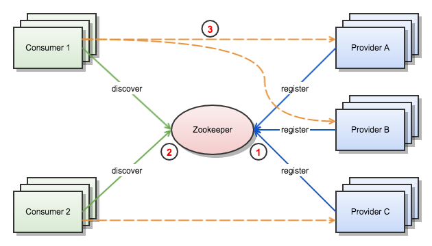
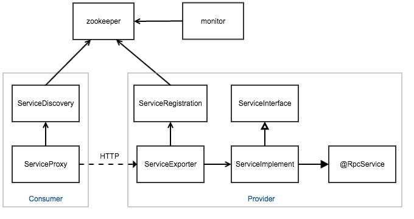

# 服务治理框架说明

## 为何需要

* 在我们的分布式服务架构中，前期追求速度和简单，没有使用服务治理框架
* 随着服务的增加，用户量订单量的上升，对弹性伸缩和扩展性有了更高要求
* 人工对不同服务器上的多个服务进行伸缩管理越来越麻烦，耗费时间且容易出错
* 依赖负载均衡的伸缩机制需要管理大量域名

## 提供能力

1. 服务启动时，自动向注册中心(zookeeper)进行注册，同一个服务可注册多个实例
2. 服务的消费者消费服务时，向注册中心获取一个服务实例的接口地址
3. 消费者使用获取到的服务实例地址直接进行服务消费

## 框架模型

### Consumer Side

#### ServiceDiscovery

* 访问注册中心，发现需要消费的服务实例
* 将消费者也注册到注册中心，便于监控管理
* 订阅服务实例节点变化，以便服务实例离线时及时更换调用的实例
* 如果调用服务实例发生异常，向注册中心报告（投票）

#### ServiceProxy

* 远程服务的本地代理，本地消费服务时直接调用该代理
* 内部封装了对远程服务调用的序列/反序列化和通信实现

### Provider Side

#### ServiceRegistration

* 注册服务实例到注册中心
* 当服务离线时从注册中心注销服务实例

#### ServiceExporter

* 自动扫描服务实现
* 使用 HttpInvoker 方式暴露服务接口

#### ServiceImplement

* 实现服务接口
* 需要将其标识为远程服务

#### @RpcService

* 标识一个服务实现是一个远程服务
* 被标识的服务将会自动被扫描到

### Monitor

* 监控服务提供者和消费者的整体状况
* 记录服务实例的变动

## 设计细节

### 服务注册

* 服务启动时在注册中心创建临时节点，当服务实例与注册中心连接关闭时临时节点自动删除
* 所有服务注册在一个命名空间（根节点）下，每个服务名创建一个节点
* 一个服务名下可创建多个服务实例节点，信息包含接口地址、（版本号）

### 服务发现

* 服务存在多个实例时，先采用轮询算法获取服务实例地址
* 订阅服务节点变化通知，对服务实例变化及时响应
* 当调用服务实例不正常时，报告异常，投票删除该实例节点